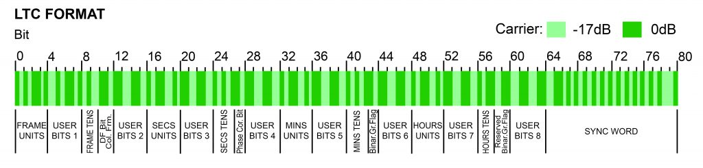
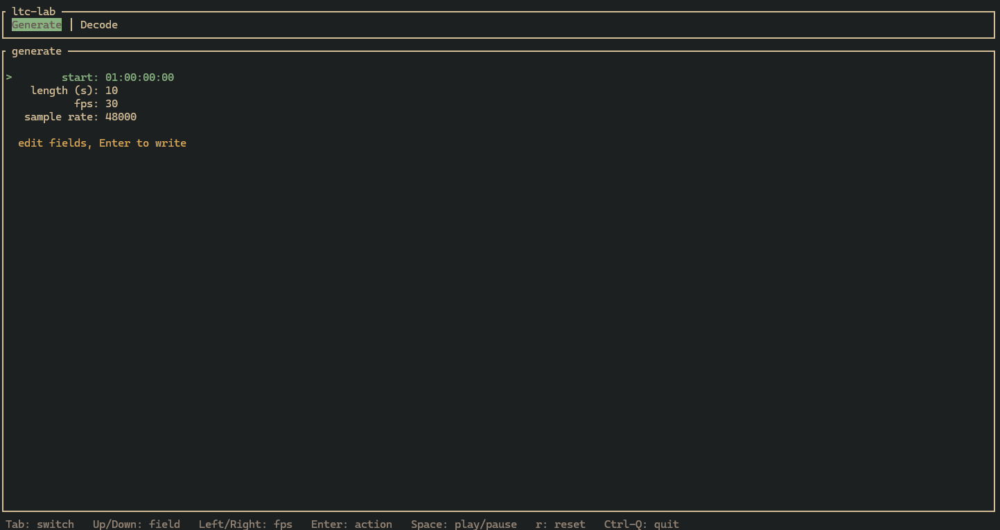
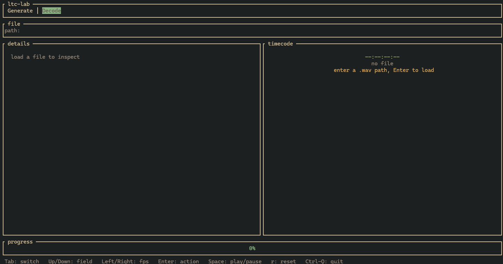
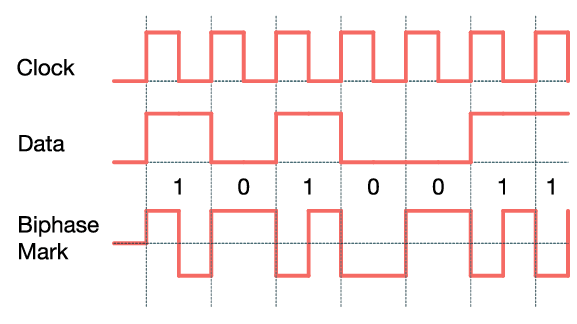

```
 ___   _________  ________  ___       ________  ________     
|\  \ |\___   ___\\   ____\|\  \     |\   __  \|\   __  \    
\ \  \\|___ \  \_\ \  \___|\ \  \    \ \  \|\  \ \  \|\ /_   
 \ \  \    \ \  \ \ \  \    \ \  \    \ \   __  \ \   __  \  
  \ \  \____\ \  \ \ \  \____\ \  \____\ \  \ \  \ \  \|\  \ 
   \ \_______\ \__\ \ \_______\ \_______\ \__\ \__\ \_______\
    \|_______|\|__|  \|_______|\|_______|\|__|\|__|\|_______|                                                           

```
# ltc-lab

Generate and decode SMPTE LTC (Linear Timecode) audio — with a terminal UI, a CLI, and a zero-dependency core library.

## What is LTC?

SMPTE 12M Linear Timecode encodes wall-clock time (`HH:MM:SS:FF`) as an 80-bit frame streamed as biphase-mark audio. Each frame carries BCD time fields, flags (notably drop-frame), and a 16-bit sync word (`0011111111111101` LSB-first). A continuous LTC track lets tapes, cameras, and audio recorders stay frame-accurately in sync.

```
80-bit LTC frame (bit 0 transmitted first):

 0         10        20        30        40        50        60        80
 |  frames |D|  seconds  |  minutes  |   hours   |  user  |   sync word   |
 | BCD units/tens  + flags + BCD fields …    + polarity/BGF  | 001111…1101 |
```



Drop-frame only applies at 29.97 fps (nominal 30): frame numbers `00` and `01` are skipped at the top of every minute except every 10th minute to keep the count aligned to wall-clock time.

## Features

- **Generate LTC WAVs** — from any start timecode, length, frame rate, and sample rate. Optional preroll and auto-named output files (`ltc_01h00m00s00f_10s_30fps_48000Hz.wav`).
- **Decode WAV files** — streaming sample-by-sample decoder that recovers timecode from mono or stereo 16-bit PCM; stereo keeps the first (left) channel.
- **Terminal UI** (default build) — two-tab `ratatui` interface:
  - **Generate** tab: edit start timecode, duration, fps (preset cycle), and sample rate; press Enter to write a WAV.
  - **Decode** tab: enter a `.wav` path, inspect whole-file analysis (start/end, frame count, inferred rate, duration, sample rate, continuity), and watch timecode roll in real time with play/pause, reset, and progress gauge.
- **Whole-file analysis** — single-pass decode that infers nominal fps from second rollovers, detects drop-frame, checks continuity, and reports duration.
- **Live audio capture** (opt-in `--features live`) — listen on the default input device via `cpal` + `rtrb` ring buffer and print timecode as it arrives.
- **Robust WAV I/O** — dependency-free `wav.rs` that walks RIFF chunks (handles extra `JUNK`/`bext`/`fact` chunks, odd-size padding, truncated `data` chunks), supports `WAVE_FORMAT_EXTENSIBLE`, and returns typed `WavError` instead of panicking.
- **Non-integer rate support** — fractional sample clocks (e.g. 29.97 fps at 48 kHz ≈ 20.02 samples/bit) render without drift; 23.976 / 29.97 handled via fractional `real` rates alongside integer `nominal` counts.
- **Well-tested core** — unit tests for frame BCD placement, polarity correction, biphase round-trips at every supported rate, decoder continuity, drop-frame realignment, and TUI rendering.

## Installation

Prerequisites: Rust stable (≥ 1.70), `cargo`.

```sh
git clone https://github.com/anomalyco/ltc-lab
cd ltc-lab
cargo build          # default: TUI + core + CLI (tui feature enabled)
./target/debug/ltc-tui   # or just: cargo run
```

System audio libraries are only needed for live capture (`--features live` pulls in ALSA on Linux).

## Build options

| Command | What you get |
|---------|--------------|
| `cargo build` / `cargo run` | **Default** — TUI (`ltc-tui`), CLI (`ltc-lab`), and library. `default-run = "ltc-tui"` so bare `cargo run` launches the TUI. |
| `cargo build --bin ltc-lab` | CLI binary only (still builds the default `tui` feature; use `--no-default-features` to skip it). |
| `cargo build --no-default-features` | Core library + CLI with zero UI dependencies (`ratatui`/`crossterm` excluded). |
| `cargo build --features live` | Adds live audio input (`cpal` + `rtrb`). Combine with `--features live` for `cargo run --features live --bin ltc-lab -- listen`. |
| `cargo build --all-features` | Everything: TUI + live capture. |

Feature flags in `Cargo.toml`:

- `tui` → `ratatui` + `crossterm` (on by default via `default = ["tui"]`)
- `live` → `cpal` + `rtrb` (opt-in, pulls in platform audio libs)

The `ltc-tui` binary has `required-features = ["tui"]` so it only builds when the `tui` feature is enabled — which it is by default.

## Usage

### TUI (default)

```sh
cargo run              # launches the TUI (default-run = ltc-tui)
cargo run --bin ltc-tui  # explicit
```



**Generate tab** — form with four fields:

| Field | How to edit |
|-------|-------------|
| `start` (HH:MM:SS:FF) | Type directly. Use `;` before frames for drop-frame, e.g. `01:00:00;00` (only valid with 29.97). |
| `length (s)` | Type a number (e.g. `10`, `0.5`). Supports fractional seconds. |
| `fps` | `Left` / `Right` cycles presets: `24`, `25`, `30`, `29.97`, `23.976`. |
| `sample rate` | Type a rate in Hz (e.g. `48000`, `44100`). |

`Up` / `Down` moves focus between fields. `Enter` writes the WAV to the current directory (auto-named unless the CLI path is used).



**Decode tab** — file playback and inspection:

1. Type a path to a `.wav` file (e.g. `ltc_01h00m00s00f_10s_30fps_48000Hz.wav`).
2. Press `Enter` to load. The **details** panel populates (start/end, frame count, inferred rate, duration, continuity).
3. The **timecode** panel rolls as the file "plays" through the streaming decoder at wall-clock speed.
4. `Space` toggles play/pause, `r` resets to the start, `Backspace` clears the loaded file and returns to path entry.

**Global keys** (shown in the footer):

| Key | Action |
|-----|--------|
| `Tab` | Switch between Generate and Decode tabs |
| `Up` / `Down` | Move focus (Generate tab) |
| `Left` / `Right` | Cycle fps preset (when fps field is focused) |
| `Enter` | Submit — generate WAV or load file |
| `Space` | Play / pause (Decode tab, file loaded) |
| `r` | Reset playback to start (Decode tab) |
| `Backspace` | Delete character (text field) or unload file (Decode playback) |
| `Ctrl-C` / `Ctrl-Q` | Quit |

### CLI

The CLI binary is `ltc-lab` (`src/main.rs`):

```sh
# Generate a 10 s WAV at 01:00:00:00, 30 fps, 48 kHz (default)
cargo run --bin ltc-lab -- generate
cargo run --bin ltc-lab -- generate --start 01:00:00:00 --length 10 --fps 30 --rate 48000

# Drop-frame at 29.97 fps (semicolon marks drop-frame; --fps 30 with ';' is treated as 29.97)
cargo run --bin ltc-lab -- generate --start 01:00:00;00 --fps 30 --out my_stripe.wav

# 25 fps, 5 s, with 2 frames of preroll
cargo run --bin ltc-lab -- generate --fps 25 --length 5 --preroll 2 --out out.wav

# Decode a WAV file (prints frame count and first/last few timecodes)
cargo run --bin ltc-lab -- decode-file ltc_01h00m00s00f_10s_30fps_48000Hz.wav

# Live capture from the default input device (requires --features live)
cargo run --features live --bin ltc-lab -- listen
cargo run --features live --bin ltc-lab -- listen --fps 25
```

Help:

```sh
cargo run --bin ltc-lab -- --help
cargo run --bin ltc-lab -- generate --help  # (flags are parsed manually; see HELP in main.rs)
```

Supported `--fps` values: `24`, `25`, `30`, `29.97`, `23.976` (and `29.97df`, `23.98` aliases). The start timecode's `;` vs `:` selects drop-frame for the 29.97 family.

### Data flow

```
                  ┌─────────────┐
  Timecode ──────►│   frame     │──► 80-bit frames ──►┌──────────┐
  RateSpec ──────►│  + rate     │                     │ biphase  │──► i16 samples ──► wav::write
                  └─────────────┘                     └──────────┘
                                                         ▲
  WAV file ──► wav::read ──► i16 samples ──► decoder::Decoder ──► Timecode stream
                                              (also: analyze → FileSummary)
```

### Biphase-mark encoding



Every bit starts with a level transition at the bit boundary. A logical `1` adds a second transition mid-bit; a logical `0` does not. Timing uses `samples_per_bit = sample_rate / (80 * fps_real)` with `round(bit_index * spb)` boundaries so the fractional remainder is distributed without cumulative drift.

### Decoder signal chain

Per-sample steps in `decoder.rs`:

1. **DC blocker** — one-pole high-pass (`R = 0.9995`).
2. **Adaptive hysteresis** — peak follower with decay, threshold at 10 % of peak; avoids chatter on noisy crossings.
3. **Interval timing** — counts samples between zero-crossings.
4. **Warmup** — first 64 intervals seed the bit-period estimate from `2 × min_interval` (sync word guarantees half-bit intervals appear).
5. **Bit-period EMA** — updated only toward full-bit equivalents (a lone full interval or `half + half`), so runs of zeros can't inflate it; `α = 1/16`, classification threshold `0.75 × period`.
6. **80-bit ring** + **sync gate** + **BCD validity gate** — emits a `Timecode` only when bits 64-79 match `SYNC` and the decoded BCD is in range.

## Testing

```sh
cargo test              # all tests (core + TUI smoke)
cargo test -- --nocapture  # show TUI render dumps
```

Tests live alongside each module:

- `frame` — BCD placement, sync word, round-trip sweeps, polarity-bit placement, `parse`/`Display`, drop-frame increment (including 10-minute realignment).
- `biphase` — exact sample counts at integer and fractional rates.
- `decoder` — round-trips at 24/25/30/29.97/23.976 fps, zero-heavy drift regression, drop-frame skip/no-skip at normal and 10th minutes.
- `analyze` — fps inference (30 NDF, 25, 29.97 DF), short-clip `unknown` case, continuity.
- `rate` — preset parsing, drop-frame inference from `;`, rejection on non-drop rates.
- `wav` — mono round-trip, extra chunks, stereo first-channel, truncated/empty/bad-magic errors, format rejection.
- `generate` — end-to-end WAV write and error paths.
- `tui` — `GenForm` editing/focus/fps cycling, `DecodePlayer` timecode advance, `App` render smoke (TestBackend 96×22, asserts `details`/`start`/`30 fps`/`continuous`).

## Roadmap and limitations

- **Live readout** — the Decode tab's wall-clock playback is the stand-in for a live audio readout; wiring `cpal` input directly into the TUI (device picker, level meter) is the next step.
- **User bits** — no user-bits format is emitted; BGF/polarity bits beyond the correction bit are left at zero.
- **WAV formats** — only 16-bit PCM mono/stereo are supported. Other depths/formats return `WavError::UnsupportedFormat`; swap in `hound` if broader support is needed.
- **No LTC user-bit modes** or jam-sync — the generator emits a straight timecode track.
